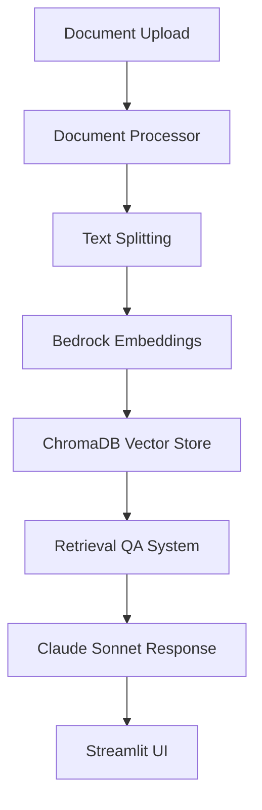

# 📚 LangChain Document Q&A System

> An intelligent containerized document question-answering system powered by LangChain

[](https://www.python.org/downloads/)
[](https://streamlit.io/)
[](https://python.langchain.com/)
[](https://aws.amazon.com/bedrock/)
[](https://www.docker.com/)

## Overview

Transform your documents into an interactive knowledge base! This application allows you to upload PDF or text documents and ask intelligent questions about their content using state-of-the-art AI models. All in a docker container!

## Architecture



### 📦 Installation

1. **Build Docker Image**
   ```bash
   docker build -t pdf-chat .
   ```
   
2. **Run Docker Container**
   ```bash
   docker compose up
   ```

3. **Open your browser** 
   Navigate to `http://localhost:8501`

## Configuration

### Model Configuration

The system uses:
- **LLM**: `us.anthropic.claude-sonnet-4-20250514-v1:0`
- **Embeddings**: `amazon.titan-embed-text-v1`
- **Vector Store**: ChromaDB with persistent storage

## Usage

### 1. Upload Document 📄
- Click "Upload a document" 
- Select your PDF or TXT file
- Wait for processing to complete

### 2. Ask Questions 💭
- Type your question in the text input
- Get comprehensive answers (250+ words)
- View source context and references

## Project Structure

```
pdf-chat/
├── main.py                 # Streamlit application entry point
├── qa_system.py           # Q&A system implementation
├── document_loader.py     # Document processing utilities
├── requirements.txt       # Python dependencies
├── refdocs/              # Uploaded documents storage
├── chroma_db/            # Vector database storage
```

## Technical Details

### Document Processing Pipeline

1. **Loading**: PyPDFLoader for PDFs, TextLoader for text files
2. **Chunking**: RecursiveCharacterTextSplitter
3. **Embedding**: AWS Bedrock Titan embeddings
4. **Storage**: ChromaDB vector database with persistence

### Q&A System

- **Retrieval**: Similarity search with top-k=3 results
- **Generation**: Claude Sonnet with custom prompt template
- **Output**: Detailed 250+ word responses with context

## Customization

### Modify Chunk Size
```python
# In document_loader.py
self.text_splitter = RecursiveCharacterTextSplitter(
    chunk_size=1500,  # Increase for larger chunks
    chunk_overlap=300
)
```

### Adjust Model Parameters
```python
# In qa_system.py
self.llm = ChatBedrock(
    model="us.anthropic.claude-sonnet-4-20250514-v1:0",
    model_kwargs={
        "max_tokens": 2000,    # Increase for longer responses
        "temperature": 0.3,    # Adjust creativity (0-1)
        "top_p": 0.9
    }
)
```


## License

This project is licensed under the MIT License - see the [LICENSE](LICENSE) file for details.

##  Acknowledgments

- **LangChain** - For the amazing framework
- **AWS Bedrock** - For powerful AI models  
- **Streamlit** - For the UI framework
- **ChromaDB** - For efficient vector storage
- **Docker** - For containerization 
